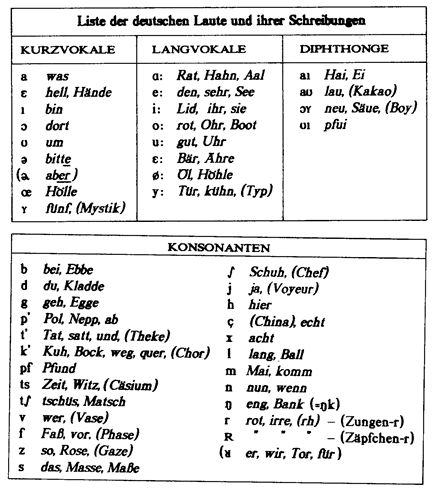

# Gegenstand und Sinn der Phonologie

Im Alltag, sei es privat oder im Beruf, verständigen wir uns vorrangig
mit Hilfe von mündlich oder schriftlich geführten Texten. Aufbau und
Wirkung eines Textes sind leichter zu erkennen, wenn man ihn nach
nachvollziehbaren Prinzipien und Methoden in kleinere Einheiten zerlegt.
In der Sprachwissenschaft hat sich eine längere Liste von Einheiten in
Texten etabliert, die man verschiedenen Bereichen zuordnen kann. Hier
sollen vor allem diejenigen Bereiche erwähnt werden, die gemeinsam die
Grammatik einer Sprache umreißen.

Der *Text* ist die umfangreichste und hierarchisch höchste kommunikative
Einheit, die aus inhaltlich zusammenhängenden *Äußerungen* besteht und
eine nachvollziehbare und sortenspezifische Struktur aufweist (Engel
1988: 33).

*Äußerungen* lassen sich als Laut- oder Schriftzeichenketten definieren,
die von einem Sprecher zwischen zwei Pausen produziert werden und aus
einem oder mehreren Sätzen bestehen können (Bußmann ^2^1990: 52). Im
Gegensatz zu Sätzen sind sie *kommunikative* Einheiten und gehören somit
auf die Ebene der *Performanz* oder Parole.

Die *Phoneme* (distinktive Sprachlauttypen) und *Phone* (Sprachlaute)
gehören zu den kleinsten Einheiten eines mündlichen Textes.

Die *Phonologie* ist eine Teildisziplin der Sprachwissenschaft, die sich
mit der lautlichen Seite von sprachlichen Äußerungen beschäftigt. Der
Ausdruck wird verschiedenartig verwendet. Im Rahmen dieser Vorlesungen
wird er als Oberbegriff für alle Teildisziplinen verwendet, die die
lautliche Seite von Sprache untersuchen, also als *Oberbegriff* für
*Phonetik*, *Phonemik*, *Phonotaktik* und *Prosodie*. So wird der
Ausdruck auch in amerikanischen sprachwissenschaftlichen Studien
verwendet (Bußmann 21990: 581). In vielen wissenschaftlichen Arbeiten
wird Phonologie im Sinne von Phonemik verwendet, also in einem
eingeschränkteren Sinne als in dieser Vorlesung. Der slowenische
Ausdruck glasoslovje wird von Toporišič ebenfalls als Oberbegriff für
die oben angeführten Teilgebiete verwendet (vgl. Toporišič 1992: 50).

## Phonemik vs. Phonetik

Die Beschreibung einer Sprache ist aus etischer und emischer Sicht
möglich. Die beiden Wortbildungselemente etisch und emisch bezeichnen
den Unterschied zwischen materieller vs. funktioneller
Sprachbetrachtung.

-   Die **Phonetik** untersucht die "akustisch meßbaren und
    artikulatorisch definierbaren aktuellen Lautäußerungen" (Bußmann
    1983). Sie "betrachtet Sprache gewissermaßen von außen und erfaßt
    und beschreibt das gesamte vorhandene Lautmaterial, ohne
    notwendigerweise Bezug auf eine bestimmte Sprache zu nehmen." (SSM
    1: 1). "Ihre Basis sind Erkenntnisse der Anatomie, Physiologie,
    Neurologie und Physik." (Bußmann ^2^1990: 579).

-   Die **Phonemik** "betrachtet die zu beschreibende Sprache von innen,
    d.h. sie untersucht die Beziehung der Laute zueinander und deren
    Funktion in dieser Sprache.

Aufgrund der oben getroffenen Unterscheidung zweier Betrachtungsweisen
sind zwei Arten von Grundeinheiten anzusetzen. Definitionen der beiden
Grundeinheiten:

-   Als Grundeinheit der Phonetik wird das **Phon** (der Sprechlaut)
    genannt, d.h. die "kleinste durch Segmentierung (Zerlegung)
    gewonnene lautliche Einheit, die noch nicht als Repräsentant eines
    bestimmten Phonems klassifiziert ist." (Bußmann ^2^1990: 576).

-   Die Grundeinheit der Phonemik ist das **Phonem**. Das Phonem ist ein
    Lauttyp und wird als Bezeichnung verwendet "für kleinste aus dem
    Schallstrom der Rede abstrahierte lautliche Segmente mit potentiell
    bedeutungsunterscheidender Funktion." (Bußmann ^2^1990: 576).

Die **Notation** von Phonen bzw. Phonemen unterscheidet sich
voneinander.

-   Phone werden in eckigen Klammern notiert: [fo:n].

-   Phoneme werden hingegen zwischen Schrägstrichen geschrieben: /r/.

Die Begriffe Phon und Phonem sollen an einigen Beispielen mit den
stimmlosen bilabialen Verschlußlauten verdeutlicht werden.

-   **Aus phonetischer Sicht** kommen in den englischen, deutschen und
    thailändischen Wörtern in (1), (2) und (3) zwei stimmlose bilabiale
    Verschlußlaute vor, und zwar [p^h^] und [p], in den slowenischen in
    (4) hingegen nur ein stimmloser bilabialer Verschlußlaut, und zwar
    [p]. Vom Standpunkt der Phonetik besteht also in dieser Hinsicht ein
    Unterschied zwischen dem Deutschen, Englischen und Thai einerseits
    und dem Slowenischen andererseits.

-   **Aus phonemischer Sicht** kann man jedoch feststellen, daß die
    Verschlußlaute [p^h^] und [p] im Englischen und Deutschen in einem
    anderen Verhältnis zueinander stehen als im Thai. Die beiden
    Verschlußlaute treten im Englischen und Deutschen in
    unterschiedlichen Umgebungen auf und sind somit ledigliche Varianten
    eines Phonems (**Allophone**). Im Thai kommen beide Verschlußlaute
    an derselben Stelle im Wort vor. Da ihre lautlichen Umgebungen
    identisch sind, bilden die Laute [p^h^] und [p] den einzigen
    phonetischen Unterschied in diesen Wörtern. Die beiden Wörter im
    Thai haben unterschiedliche Bedeutung, was auf die beiden
    Verschlußlaute zurückgeführt werden kann. Die stimmlosen bilabilaen
    Verschlußlaute [p^h^] und [p] haben im Thai
    bedeutungsunterscheidende Funktion, im Englischen und Deutschen
    hingegen nicht. Daher müssen sie im Thai zwei Phonemen zugeordnet
    werden (6), im Englischen und Deutschen hingegen nur einem Phonem
    (5). Das slowenische Phonem /p/ wird in (4) immer nur durch ein Phon
    realisiert, und zwar durch [p].

## Aufgabenbereich der Phonetik

Die Phonetik ist eine Naturwissenschaft auf der Grundlage von Anatomie,
Physiologie, Physik (Akustik) und Mathematik.

Ihre Aufgabe ist nach Gross (^2^1990: 35) die materielle Analyse
sprachlicher Äußerungen bzw. Laute als eine der Grundlagen

-   der theoretischen Linguistik und Dialektologie und

-   für die Lösung praktischer Probleme in der Patholinguistik,
    Sprachdidaktik und Computerlinguistik.

Aus dem jeweiligen Ort im Kommunikationsprozeß (Sprecher - Text - Hörer)
ergeben sich laut Gross (^2^1990: 36) **drei Teilgebiete der Phonetik**:

-   Die **artikulatorische Phonetik** beschreibt die Produktion der
    Laute, und zwar nach Artikulationsart und Artikulationsort.

-   Die **akustische Phonetik** beschreibt die Laute nach ihren
    physikalischen Eigenschaften (z.B. Dauer, Frequenz, Intensität) und
    erstellt mit Hilfe spezieller Meßgeräte verschiedenartige Diagramme
    z.B. Sonagramme.

-   Die **auditive Phonetik** untersucht die Rezeption und Analyse
    sprachlicher Zeichen durch Ohr, Nervenbahnen und Gehirn. Neben rein
    physikalischen Gegebenheiten ist in diesem Teilgebiet immer ein
    gewisses Maß an nicht direkt meßbaren (semantischen,
    psychologischen) Prozessen vorhanden (vgl. Neppert/Pétursson
    ^3^1992: 8). Die auditive Phonetik ist das am wenigsten entwickelte
    Teilgebiet der Phonetik. Jedes Teilgebiet verfügt über eigene
    Grundeinheiten (vgl. Neppert/Pétursson ^3^1992: 8).

Im Rahmen des Phonetikunterrichts für Studenten der Germanistik,
insbesondere Studenten des Deutschen als Fremdsprache, steht der
Teilbereich der artikulatorischen Phonetik meist im Vordergrund, d.h.
die Bildungsweise und der Bildungsort der deutschen Laute.

Durch die Segmentierung von Äußerungen erhält man ein **Lautinventar**,
d.h. eine Liste aller Laute einer Sprache. Je genauer man die
Untersuchung betreibt, desto länger wird die Liste; jeder Laut hat
nämlich beliebig viele Varianten - in Abhängigkeit von verschiedenen
lautlichen Umgebungen und verschiedenen Sprechern.

Das Lautinventar gilt als Grundlage für den nächsten Schritt, die
Ermittlung von Phonemen (Lautmustern) und des **Phoneminventars** einer
Sprache. Als Beispiel folgt ein **Lautinventar der deutschen Sprache**
aus Gross (^2^1990: 36-37), das allerdings nicht alle Lautrealisierungen
im Deutschen auflistet.

Eine etwas umfangreichere Liste von Lauten der deutschen Sprache finden
sich z.B. im Duden (1973: 23-24). Zum **slowenischen Laut- und
Phoneminventar** vgl. Toporišič (^2^1991: 39ff.).

## Aufgabenbereich Phonemik

Die Phonemik erforscht Lautsysteme. Ihre Aufgabe besteht also darin,
"die Beziehungen der Laute einer gegebenen Sprache zueinander zu
analysieren, um so das Lautsystem zu beschreiben." (SSM 1: 2) In der
Tagmemik, einer wichtigen Richtung des amerikanischen Strukturalismus
(Hauptvertreter K. L. Pike), werden alle sprachlichen Einheiten unter
drei Gesichtspunkten untersucht:

-   Opposition,

-   Variation und

-   Distribution.

### Opposition

Die Wortpaare (oder besser: Lautfolgen) in den folgenden Beispielen
unterscheiden sich jeweils nur durch einen Laut. Diejenigen Laute, die
sich voneinander unterscheiden (also distinktive phonetische Merkmale
aufweisen), stehen in Opposition (nach einer anderen Ausdrucksweise "in
paradigmatischem Kontrast") zueinander, womit gesagt sein soll, daß sie
bedeutungsunterscheidende Funktion haben.

(8) Deutsch: [lant] "Land" vs. [vant] "Wand"

(9) Slowenisch: [ko:s] "kos" (Stück) vs. [vo:s] "voz" (Wagen)

(10) Englisch: [fɪʃ] "fish" (Fisch) vs. [dɪʃ] "dish" (Gefäß).

Somit müssen [l] und [v] im deutschen Beispiel, [k] und [v] im
slowenischen und [f] und [d] im englischen jeweils zwei Phonemen
zugeordnet werden: in (8) den Phonemen /l/ und /v/, in (9) den Phonemen
/k/ und /v/ und in (10) den Phonemen /f/ und /d/.

Opposition ist eine **paradigmatische Beziehung**, Kontrast dagegen eine
syntagmatische. Eine Opposition ist eine **symmetrische Beziehung**
zwischen sprachlichen Lauten. In den Lautfolgen der Wörter \<fast\> und
\<Rast\> steht der Obstruent [f] in Opposition zum Liquid [R] und
umgekehrt. **Kontrast** ist dagegen eine **asymmetrische Beziehung**
zwischen sprachlichen Lauten (vgl. Eisenberg 1998: 88). In einer Form
wie \<Frau\> steht der Liquid /r/ in Kontrast zum Obstruenten /f/,
während der Obstruent /f/ in dieser Position nicht in Kontrast zum
Liquid /r/ stehen kann, da eine (einsilbige) Form wie [rfao] nicht
vorkommt. In anderen Umgebungen kontrastiert der Obstruent durchaus mit
dem Liquid*,* z.B. in [Wurf], aber der Liquid nicht mit dem Obstruenten
[Wufr]. Beide Lautfolgen (d.h. [fr] und [rf]) sind somit an
unterschiedliche Kontexte gebunden. Der Kontrastbegriff ist die
Grundlage für die Ermittlung der **phonotaktischen
Kombinationsmöglichkeiten** (Lautkombinatorik) in einer Sprache. Als
operationale Verfahren zur Ermittlung einer **Opposition** verwenden wir
die **Kommutations- oder Substitutionsprobe**, zur Ermittlung eines
**Kontrastes** dagegen die **Permutations- oder Verschiebeprobe**. Die
in den oben angeführten Beispielen durchgeführte Kommutationsprobe nennt
man übrigens auch den **Minimalpaartest**. (vgl. auch in der
Dudengrammatik, Band 4 (1995: 32-33) über die funktionalen Eigenschaften
Opposition und Kontrast am Beispiel des Wortes \<Markt\>).

### Variation

Zwei verschiedene Laute einer Sprache stehen nicht immer in Opposition
zueinander. Können verschiedene Laute nicht als Phoneme eingeordnet
werden, dann besteht die Möglichkeit, dass es sich um Varianten eines
einzigen Phonems (auch **Allophone** genannt) handelt.
**Phonemvariation** kann **frei** oder **stellungsgebunden** sein.

(11) Deutsch: [reː.ɡən] vs. [Reː.ɡən] vs. [ʁeː.ɡən] "Regen"
(12) Slowenisch: [ta.nək] tanek "dünn", masc. vs. [taŋ.ka] tanka "dünn",
     fem.

Im deutschen Wort \<Regen\> (11) kann das Phonem /r/ verschiedentlich
realisiert werden, ohne dadurch die Bedeutung der Lautfolge zu
verändern. Im Deutschen sind die drei r-Laute [r], [R] und [ʁ] freie
Varianten eines einzigen Phonems, d.h. **fakultative Allophone** des
Phonems /r/. Auch im Slowenischen können die oben genannten r-Laute frei
variieren, ohne die Wortbedeutung zu verändern. In der slowenischen
Standardsprache ist allerdings im Unterschied zur deutschen nur das
alveolar apikale [r] üblich, das auch als Zungenspitzen-r bekannt ist.
In einer anderen Sprache können verschieden realisierte r-Laute
allerdings auch in Opposition zueinander stehen und somit als zwei
verschiedene Phoneme eingeordnet werden (z.B. im Spanischen ein langer
und ein kurzer r-Laut).

Das Phonem /n/ wird im Slowenischen (12) je nach Lautumgebung als
dental-alveolares [n] oder als velar-postdorsales [ŋ] realisiert. Vor
einem Vokal wird beispielsweise die erste Variante ausgesprochen, vor
den velaren Obstruenten [k], [g] und [x] die letztere (Toporišič
^2^1991: 71). Das Phonem /n/ weist demnach im Slowenischen (neben
anderen hier nicht aufgeführten) zumindest zwei **stellungsbedingte
Allophone** (positionsabhängige, stellungsgebundene oder kombinatorische
Allophone) auf. Im Slowenischen sind die beiden Allophone **komplementär
verteilt**, d.h. daß das [n] nicht in allen Lautumgebungen vorkommt, in
denen [ŋ] auftritt, und umgekehrt.

Auch im Deutschen kommt der velare Nasalkonsonant [ŋ] ebenfalls nicht in
allen Lautumgebungen vor (wie im Slowenischen ist er im Silbenanlaut
ausgeschlossen), aber an der Silbengrenze zwischen Vokalen steht er in
Opposition zum alveolaren Nasalkonsonant [n] (vgl. \<Wanne\> vs.
\<Wange\>). Die Tatsache, dass mit Hilfe eines Minimalpaartests eine
Opposition zwischen den beiden deutschen Nasalkonsonanten gefunden
werden konnte, kann man als Argument für die Unterscheidung zweier
Phoneme werten. Dagegen spricht, dass der velare Nasalkonsonant in
weniger Lautumgebungen vorkommt als der alveolare Nasalkonsonant.

Der phonetische Unterschied in slowenischen Beispiel (12) ist demnach
durch die Lautumgebung bestimmt. Man kann also von der lautlichen
Umgebung her schließen, welchen phonetischen Wert das Phonem /n/ in
dieser Umgebung hat. Somit sind die beiden Laute (Phone) im Slowenischen
Varianten einer Lauteinheit (eines Phonems), und es genügt, ein einziges
phonemisches Zeichen /n/ für beide phonetischen Varianten [n] und [ŋ]
anzusetzen. Im Slowenischen wird dieses Verhalten auch in der
Ortographie (Rechtschreibung) ausgedrückt, denn beide
Realisierungsformen des Phonems werden durch das gleiche Graphem
wiedergegeben (auch in Eigennamen, vgl. (13)).

(13) \<Ana\> vs. \<Anka\>.

Im Deutschen spricht die Orthographie nicht dafür, die beiden
Nasalkonsonanten einem einzigen Phonem zuzuordnen, denn die beiden Laute
werden im einheimischen Wortschatz durch unterschiedliche Grapheme
wiedergegeben: so wird der alveolare Nasalkonsonant mit dem Graphem
\<n\> wiedergegeben (wie z.B. in \<Biene, Wanne\>), während dem velaren
Nasalkonsonanten das Graphem \<ng\> zugeordnet wird (wie z.B. in
\<Wange, Klinge, Zunge\>). Die beiden deutschen Nasalkonsonanten könnten
eher als zwei verschiedene Phoneme gewertet werden, die beiden
slowenischen Nasalkonsonanten dagegen eher als ein Phonem (mit
stellungsbedingter Phonemvariation).

### Distribution

Beim Vergleich zweier Sprachen kann man oft feststellen, dass in beiden
zwar derselbe Laut (oder zwei sehr ähnliche Laute) vorkommt, aber
jeweils in unterschiedlicher Position. Der betreffende Laut hat in
beiden Sprachen also eine unterschiedliche Verteilung oder Distribution.
Dieser Umstand soll am Beispiel des velaren Nasalkonsonanten illustriert
werden.

Der **velare Nasalkonsonant** [ŋ] kommt in der **deutschen
Standardsprache** in den folgenden Positionen vor:

-   im Wort- und Silbenauslaut nach ungespannten Vokalen (z.B. \<Ding,
    eng, Gang, Gong, Dung\>);

-   im Wort- und Silbenauslaut als Folge der Schwa-Tilgung und der
    Assimilation nach [g] und [k] in derselben Silbe (z.B. \<fragen,
    packen\>);

-   im Silbenauslaut vor [k] im Anlaut der nächsten Silbe (z.B.
    \<trin-ken\>);

-   im Silbenauslaut vor [g] im Anlaut der nächsten Silbe, aber nur in
    Lehnwörtern (z.B. \<Tan-go, Un-garn, Lin-gu-ist\>);

-   im Wort- und Silbeninlaut vor [k] in derselben Silbe (z.B.
    \<Schank\>);

-   im Inlaut als sogenanntes Silbengelenk (d.h. gleichzeitig im Auslaut
    der ersten Silbe und im Anlaut der zweiten) vor Schwa [ə] (z.B.
    \<hängen\>) oder als Folge von Assimilation vor sonantischem [l̩]
    (z.B. kling(e)ln).

In der **slowenischen Standardsprache** tritt der **velare
Nasalkonsonant** [ŋ] in den folgenden Positionen auf:

-   im Silbenauslaut nach ungespannten Vokalen vor [g], [k] und [x] in
    der nächsten Silbe (z.B. \<An-hovo, Kon-go, Can-kar\>);

-   im Silbeninlaut nach ungespannten Vokalen vor [k] in derselben Silbe
    (z.B. \<tank\>).

Aus dieser Gegenüberstellung ist ersichtlich, daß die **Distribution**
des velaren Nasalkonsonanten **im Slowenischen eingeschränkter** ist als
im Deutschen, denn im Slowenischen kann er nicht stehen:

-   im Silben- oder Wortauslaut, wenn kein [k] in derselben oder der
    nächsten Silbe folgt;

-   im Inlaut vor Schwa [ə] oder sonantischem [l̩];

-   im Auslaut nach [g] und [k] (d.h. aufgrund von Schwa-Reduktion und
    regressiver Nasalassimilation an einen velaren Obstruenten wie im
    deutschen Verb \<fragen\>).

**Tabelle 2: Distribution des Nasalkonsonaten [ŋ] im Deutschen und
Slowenischen**

+----------------------+----------------------+----------------------+
|                      | **Deutsch**          | **Slowenisch**       |
+======================+======================+======================+
| **Wort- u.           |                      |                      |
| Silbenanlaut**       |                      |                      |
+----------------------+----------------------+----------------------+
| **Wort- u.           | vor [k]              | vor [k]              |
| Silbeninlaut**       |                      |                      |
+----------------------+----------------------+----------------------+
| **Wortinlaut         | vor [ə] und [l̩]      |                      |
| (Silbengelenk)**     |                      |                      |
+----------------------+----------------------+----------------------+
| **Silbenauslaut**    | nach ungespann.      | nach ungespann.      |
|                      | Vokal:               | Vokal:               |
|                      |                      |                      |
|                      | vor [k]              | vor[k],              |
|                      |                      |                      |
|                      |                      | vor [g],             |
|                      |                      |                      |
|                      |                      | vor [x]              |
+----------------------+----------------------+----------------------+
| **Wortauslaut**      | nach [g] und [k] in  |                      |
|                      | unbetonter Silbe     |                      |
|                      | (bei Schwa-Tilgung)  |                      |
+----------------------+----------------------+----------------------+

 

In einem Fall ist die Distribution des velaren Nasalkonsonanten im
Deutschen jedoch eingeschränkter, denn im Slowenischen kann der velare
Nasalkonsonant vor [x] in der nächsten Silbe auftreten, im Deutschen
jedoch nicht.

Beide Sprachen haben u.a. gemeinsam, daß der velare Nasalkonsonant nicht
im Silbenanlaut vorkommen kann. Diese Möglichkeit besteht in anderen
Sprachen, z.B. im Kulunge, einer Sprache Nepals (SSM 1: 3).

[Wals Online](https://wals.info/)

Im Rahmen der Lautdistribution wird auch die Häufigkeit des Vorkommens
eines Lautes untersucht, anhand derer sich oft charakteristische
Unterschiede zwischen Sprachen feststellen lassen (SSM 1: 3). So tritt
z.B. der stimmhafte postalveolare Frikativ [ʒ] im Deutschen nur in
wenigen Lehnwörtern auf (z.B. \<[G]{.ul}enie, Gara[g]{.ul}e\>) und hat
daher eine eher periphere Stellung im deutschen Phonemsystem. Im
Französischen oder im Slowenischen tritt dieser stimmhafte Frikativ
jedoch in einer viel größeren Anzahl von Wörtern auf und gehört eher zum
Kern des französischen bzw. slowenischen Phonemsystems (z.B. franz.
\<[j]{.ul}e\> "ich", \<[j]{.ul}our\> "Tag", \<pi[g]{.ul}eon\> "Taube";
slow. \<[ž]{.ul}ena\> "(Ehe)frau", \<[ž]{.ul}oga\> "Ball",
\<[ž]{.ul}aba\> "Frosch").

### Phonem- und Silbeninventare

Zur Orientierung sollen einige Angaben zur Phoneminventargröße
herangezogen werden. In der Untersuchung von Ian Maddieson (Consonant
Inventories, In: Wals 2005) findet man folgende Angaben zur **Größe von
Konsonanteninventaren** in den Sprachen der Welt (gemeint sind
Konsonantenphoneme):

|     | **Consonant Inventory Size** |     |
|:---:|:----------------------------:|:---:|
| 1\. |            Small             | 91  |
| 2\. |       Moderately small       | 121 |
| 3\. |           Average            | 181 |
| 4\. |       Moderately large       | 116 |
| 5\. |            Large             | 53  |
| \@  |            Total             | 562 |

 

-   Die **typischere Konsonanteninventargröße** liegt in den unteren
    Zwanzigern, wobei der Mittelwert für die 562 Sprachen 22,7 beträgt,
    der Modus 22 und der Median 21. Konsonanteninventare in der Nähe
    dieser Größe (**22 ± 3**) wurden als **durchschnittlich**
    kategorisiert, und der Rest unterteilt in die Kategorien klein (von
    6 bis 14 Konsonanten), mäßig klein (15-18), mäßig groß (26-33) und
    groß (34 oder mehr Konsonanten).

-   **Slowenisch** kann wie **Deutsch** oder Britisches Englisch in die
    Gruppe mit **durchschnittlich** vielen Konsonantenphonemen
    (»average«) eingeordnet werden (19  Konsantenphoneme: p, t, k, b, d,
    g, f, v, s, z, s, S, j, Z, x, m, n, r, l).

-   Rotokas (West Bougainville; Papua-Neuguinea) hat nur sechs
    Konsonanten: /p, t, k, b, d, g/. !Xóõ (Southern Khoisan; Botswana)
    hat 122 Konsonanten, hauptsächlich weil es sehr viele verschiedene
    Klicklaute gibt, mit denen ein Wort beginnen kann.

 

[Wals Online](https://wals.info/)

In Maddieson (in: Wals 2005) finden wir folgende Angaben zur Größe von
**Vokalinventaren** (gemeint sind Vokalphoneme):

|     | **Vowel Quality Inventory** |        |     |
|:---:|:---------------------------:|:------:|:---:|
| 1\. |    Small vowel inventory    | (2-4)  | 92  |
| 2\. |   Average vowel inventory   | (5-6)  | 288 |
| 3\. |    Large vowel inventory    | (7-14) | 183 |
|  §  |            Total            |        | 563 |

[Wals Online](https://wals.info/)

 

-   Der **Umfang** des kleinsten erfassten Vokalqualitätsinventars ist 2
    und des größten 14.

-   Es gibt 4 Sprachen in der Stichprobe mit **nur zwei**
    kontrastierenden Vokalqualitäten. Ein Beispiel für dieses Extrem ist
    Yimas (Lower Sepik-Ramu; Papua-Neuguinea).«

-   Nur eine Sprache in der Stichprobe, **Deutsch**, verwendet 14
    Vokalqualitäten (i, I, e, E, a, A, O, o, U, u; y, Y, 9, 2; die
    Phonemvarianten \@ in *bitt[e]{.ul}* und 6 in *bess[er]{.ul} nicht
    berücksichtigt*) »und nur 2 verwenden 13 Vokalqualitäten, nämlich
    die hier enthaltene Variante des britischen Englisch and Bété (Kru,
    Niger-Congo; Côte d'Ivoire).

-   Deutlich mehr Sprachen haben einen Bestand von **fünf Vokalen** als
    jede andere Zahl -- 188 oder etwas mehr als ein Drittel. Die
    zweithäufigste Inventargröße sind **sechs Vokalqualitäten** mit 100
    Sprachen (oder 17,8% der Stichprobe).

-   Vokalqualitätsinventare mit 5 oder 6 Mitgliedern wurden in der
    Kategorie „Durchschnitt" zusammengefasst, während solche mit 4 oder
    weniger als „klein" und solche mit 7 oder mehr als „groß" eingestuft
    werden. Sprachen mit „durchschnittlicher" Vokalinventargröße machen
    mehr als die Hälfte der Stichprobe aus (51,2 %), etwa ein Drittel
    (32,5%) hat „große" Vokalqualitätsinventare und nur 16,3 % haben
    „kleine" Vokalqualitätsinventare.

-   **Slowenisch** verfügt in betonten Silben über 7 verschiedene
    Vokalqualitäten, die distinktiv genutzt werden (i, e, E, a, O, o, u)
    und kann damit (mit nur etwa halb so vielen distinktiv genutzten
    Vokalqualitäten) in dieselbe Gruppe eingeordnet werden wie
    **Deutsch** oder **Britisches Englisch**, die (mit 14 bzw. 13
    distinktiv genutzten Vokalqualitäten) am oberen Ende dieser Gruppe
    anzusiedeln sind.

-   **In unbetonten Silben** ist die Anzahl der distinktiv genutzten
    Vokalqualitäten gewöhnlich kleiner, so auch im **Slowenischen**
    (keine hohen oder mittelhohen Vokale i, e, u) und **Deutschen**
    (lediglich \@, 6).

**Konsonanten-Vokal-Verhältnis** in den Sprachen der Welt (Maddieson, in
Wals 2005):

-   Das Verhältnis wird einfach durch Division der Anzahl der
    Konsonanten (C) durch die Anzahl der Vokalqualitäten (VQ) berechnet
    und wird als C/VQ-Verhältnis bezeichnet.

-   Die resultierenden Zahlen reichen von einem Tief von nur etwas über
    1 bis zu einem Hoch von 29. Der niedrigste Wert unter den 563
    Sprachen, für die er berechnet wurde, wird von Andoke (isoliert;
    Kolumbien) repräsentiert, das 10 Konsonanten und 9 Vokalqualitäten
    hat. Die höchste Zahl wird von Abkhaz (Nordwestkaukasier; Georgien)
    repräsentiert, das mit 58 Konsonanten, aber nur 2 Vokalqualitäten
    analysiert wird. Das Verhältnis bewegt sich somit zwischen 1,11 und
    29, aber die häufigeren Werte liegen näher am unteren Ende der
    Spanne: der Mittelwert beträgt 4,25 und der Median 3,5.

-   Die Sprachen wurden in fünf Kategorien eingeteilt, basierend auf der
    Aufteilung des Bereichs in geeignete Schritte unterhalb, nahe und
    oberhalb des Medians, um ein Histogramm mit annähernd normaler
    Verteilung zu erstellen. Sprachen mit einem Verhältnis von 2,0 oder
    weniger wurden als „niedriges" C/VQ-Verhältnis eingestuft.
    Diejenigen mit einem Verhältnis über 2,0, aber unter 2,75 wurden als
    „mäßig niedrig" eingestuft. Personen mit einem Verhältnis von 2,75
    oder höher aber kleiner als 4,5 wurden als „durchschnittlich",
    solche mit Werten von 4,5 oder höher aber kleiner als 6,5 als „mäßig
    hoch" und solche mit Werten über 6,5 als „hoch" eingestuft. Nur 10
    Sprachen haben Verhältnisse von 12 oder höher.«

-   **Slowenisch** gehört in die Gruppe »**moderately low**«,
    **Deutsch** und **Britisches Englisch** aufgrund der vielen
    distinktiv genutzten Vokalqualitäten in die Gruppe »**low**«.  

 

|       | **Consonant-Vowel-Ratio** |     |
|:-----:|:-------------------------:|:---:|
|  1\.  |            Low            | 59  |
|  2\.  |      Moderately low       | 97  |
|  3\.  |          Average          | 234 |
|  4\.  |      Moderately high      | 102 |
|  5\.  |           High            | 71  |
| total |            563            |     |

[Wals Online](https://wals.info/)

 

**Silbentypen in den Sprachen der Welt** (Maddieson, in: Wals 2005).

-   Die einzige Silbenart, die **in jeder Sprache** vorzukommen scheint,
    ist **CV**, dh eine Silbe, die aus nur einem Konsonanten vor einem
    Vokal besteht. In relativ wenigen Sprachen ist dies die einzige
    erlaubte Silbenart. Zu diesen Sprachen gehören Hawaiianisch und Mba
    (Adamawa-Ubangian, Niger-Kongo; Demokratische Republik Kongo).
    Häufiger findet man Sprachen, in denen der Anfangskonsonant nicht
    erlaubt ist, wie zum Beispiel in Fidschian, Igbo (Niger-Kongo;
    Nigeria) und Yareba (Yareban; Papua-Neuguinea). Für diese Sprachen
    kann die kanonische Silbe als (C)V dargestellt werden, wobei die
    Klammern angeben, dass ein Anfangskonsonant ein optionales Element
    ist. Wenn eine Sprache nur Silben zulässt, die in diese Vorlage
    passen, spricht man von einer einfachen Silbenstruktur.

-   Eine etwas **aufwändigere Silbenstruktur** verfügt über einen
    weiteren Konsonanten, entweder am Ende der Silbe oder am Anfang, was
    die Strukturen CVC und CCV ergibt; beides sind mäßige Erweiterungen
    des einfachen CV-Silbentyps. Es lohnt sich jedoch, zwischen zwei
    Arten von zweigliedrigen Konsonantenketten zu unterscheiden. In
    einer sehr großen Anzahl von Sprachen sind zwar zwei Konsonanten am
    Anfang einer Silbe erlaubt, es gibt jedoch strenge Grenzen für die
    zulässigen Kombinationen. Der zweite von zwei Konsonanten ist
    gewöhnlich darauf beschränkt, einer aus einer kleinen Menge zu sein,
    die entweder zur Klasse der Liquide oder der Klasse der Gleitlaute
    gehört. Die Liquide sind die Laute, die üblicherweise durch die
    Buchstaben \<r\> und \<l\> dargestellt werden, während Glides
    vokalähnliche Konsonanten sind, wie die am Anfang der slowenischen
    Wörter \<vlak\> und \<jarem\>. Liquiden und Gleitlauten ist
    gemeinsam, dass ihre Bildung einen relativ ungehinderten Luftstrom
    aus dem Mund ermöglicht. Sprachen, die einen einzelnen Konsonanten
    nach dem Vokal zulassen und/oder zwei Konsonanten vor dem Vokal
    zulassen, sich aber nur an die oben beschriebenen üblichen
    zweigliedrigen Konsonantenmuster halten, werden als **mäßig komplexe
    Silbenstruktur** gezählt. Ein Beispiel ist Darai (Indoarisch;
    Nepal). Hier ist CCVC die am stärksten erlaubte Silbe, wie in /bwak/
    „(sein) Vater", aber der einzig mögliche zweite Konsonant in einer
    Folge von zwei ist /w/.

-   Sprachen, die freiere Kombinationen von zwei Konsonanten in der
    Position vor einem Vokal oder drei oder mehr Konsonanten in dieser
    Anfangsposition und/oder zwei oder mehr Konsonanten in der Position
    nach dem Vokal zulassen, werden als **komplexe Silbenstruktur**
    klassifiziert. Ein offensichtliches Beispiel für eine komplexe
    Struktur ist das Englische, dessen kanonisches Silbenmuster oft als
    (C)(C)(C)V(C)(C)(C)(C) zitiert wird. Die volle Ausdehnung des
    Musters findet nur in wenigen Wörtern statt, wie zum Beispiel
    \<strengths\>, wenn sie /strENkTs/ ausgesprochen werden, aber es ist
    relativ einfach, Silben zu finden, die mit drei Konsonanten beginnen
    oder mit vier enden, wie in \<split\> und \<texts\> (/tEksts/).

-   Die Einteilung von Sprachen in drei Kategorien der Silbenkomplexität
    (einfach, moderat und komplex) übersieht natürlich viele andere
    Fragen der Segmentverteilung (zum Beispiel, ob die Silben am Anfang
    und am Ende von Wörtern die gleichen oder andere Einschränkungen
    haben als die wortinternen) oder wichtige Unterschiede außer Acht
    lassen, wie selten oder häufig die komplexeren Silbentypen in einer
    bestimmten Sprache vorkommen. Wenn zum Beispiel einige Arten von
    Konsonantensequenzen erst kürzlich durch das Entlehnen
    internationaler Wörter (wie Sport oder Golf) in eine Sprache
    eingeführt wurden, wird die Sprache nach dem, was im etablierteren
    Vokabular vorkommt, klassifiziert. Trotz ihres zusammenfassenden
    Charakters bietet die Drei-Wege-Klassifikation eine sinnvolle
    Gruppierung mit interessanten geografischen Merkmalen.

-   **Slowenisch** und **Deutsch** lassen sich wie Englisch in die
    Gruppe der Sprachen mit **komplexen Silbenstrukturen** einordnen.

|     | **Complexity of Syllable structure**  |     |
|:---:|:-------------------------------------:|:---:|
| 1\. |       Simple syllable structure       | 61  |
| 2\. | Moderately complex syllable structure | 274 |
| 3\. |      Complex syllable structure       | 150 |
| \@  |                 total                 | 485 |

[Wals Online](https://wals.info/)

## Phonem und Hierarchie

Die phonologisch relevanten Einheiten können verschiedenen hierarchisch
gegliederten Ebenen zugeordnet werden. Jede Einheit einer Ebene besteht
aus Einheiten der darunterliegenden Ebene und dient gleichzeitig als
Baustein für die Einheit der nächsthöheren Ebene. Die Anzahl der
phonologisch relevanten Ebenen ist **theorieabhängig**. Die
**Phonemebene** wird in phonologischen Modellen oft als die unterste
Ebene der phonologischen Hierarchie angesetzt. Darüber liegen zumindest
die **Silben- und** die **Wortebene**. In vielen Sprachen ist es oft
nützlich, auch noch andere Ebenen anzusetzen, etwa eine
**Akzentgruppenebene**, eine **Satzebene** und eine **Äußerungsebene**
anzusetzen, um bestimmte Erscheinungen (wie z.B. die stellungsbedingte
Akzentuierung bestimmter Silben, Frequenzverläufe, Lautreduktionen,
Vokaldauer, u.a.) erklären zu können. Die Äußerungsebene ist
hierarchisch über den anderen Ebenen angesiedelt (vgl. SSM 1: 3):

-   Äußerungsebene

-   Akzentgruppe

-   Wortebene

-   Silbenebene

-   Phonemebene

-   ... .

 

## Phonemik im Fremdsprachenunterricht

Bestimmte Laute kommen in (fast) allen Sprachen der Welt vor, z.B.
bilabiale Verschlußlaute wie [p] und [b], Nasalkonsonanten wie [m]
(bilabial) und [n] (dental-alveolar) oder offene Vokale wie z.B. [a].

Allerdings gibt es in jeder Sprache auch bestimmte Laute, die nicht
benutzt werden, obwohl sie theoretisch möglich wären. Stattdessen wird
bekanntlich in jeder eine bestimmte Auswahl getroffen. So gibt es z.B.
im Deutschen oder Slowenischen kein *th* [đ] wie im Englischen, im
Standardslowenischen kein [h] und [ç] wie im Deutschen oder im
Englischen kein [x] wie im Deutschen.

Oft kommt es vor, dass ein bestimmter Laut im Lautinventar mehrerer
Sprachen angeführt wird, aber die Distribution und/oder Häufigkeit
dieses Lautes kann sich wesentlich unterscheiden (vgl. oben).

Die Phonemik hilft dem Fremdsprachenlernenden, sich des Lautsystems der
eigenen Sprache wie auch des Lautsystems der Fremdsprache bewußt zu
werden. Kennt man nämlich die Unterschiede der beiden Lautsysteme, kann
man eine ganze Reihe von Aussprachefehlern vermeiden und die
Fremdsprache auch schneller und besser erlernen (SSM 1: 4).

Im Deutschen stehen die beiden Frikative [x] und [h] in komplementärer
Distribution (d. h. der glottale Frikativ [h] erscheint in nativen
Wörtern nur silbeninitial vor Vokal wie beispielsweise in
\<[H]{.ul}aus\>, [x] dagegen in nativen Wörtern nach dem Vokal einer
Silbe wie beispielsweise in \<na[ch]{.ul}\>) und können daher nicht zu
einem Phonem zusammengefasst werden.

Der Laryngalkonsonant [h] steht allerdings in Oppostion zum
Glottisverschlußlaut [ʔ], so dass man ausgehend von einem
Minimalpaartest von zwei Phonemen sprechen kann.

Im Standardslowenischen ist [h] nicht einmal Bestandteil des
Lautinventars. Im Slowenischen besteht somit kein phonemischer
Unterschied zwischen [x] und [h]. Daher können beide Laute im
Slowenischen frei miteinander vertauscht werden, ohne dass dadurch ein
Bedeutungsunterschied entsteht. Ein Slowene, der das Phonemsystem seiner
eigenen Sprache und das der deutschen nicht kennt und sich der
unterschiedlichen Funktion der beiden Laute in den beiden Sprachen nicht
bewusst ist, wird große Mühe haben, den Unterschied zwischen [x] und [h]
im Deutschen überhaupt wahrzunehmen und den Unterschied in seiner
Aussprache korrekt auszuführen (vgl. SSM 1: 4 zum phonemischen Wert von
[r] und [l] im Japanischen und Koreanischen).

## Phonemik und Orthographie

Die Phonemik ist notwendig bei der Erarbeitung eines angemessenen
Alphabets. Das **ideale Alphabet** ist wohl - zumindest vom Standpunkt
eines Schreibers oder Lesers auf einer bestimmten Zeitebene -
**phonemisch**, d.h. jedem Phonem entspricht ein bestimmtes - und immer
dasselbe - Schriftzeichen (**Graphem**). In den meisten Schriftsprachen
ist das allerdings nicht der Fall, denn Phoneme und Grapheme (Buchstaben
und Buchstabenverbindungen) sind keineswegs imer identisch. Die
Aussprache von Wortformen in einer Sprache ändert sich mit der Zeit,
während Graphemsysteme solche Veränderungen oft nur teilweise, überhaupt
nicht oder erst nach einer gewissen Zeit mitmachen. Graphemsysteme
richten sich nach mehreren (oft gegensätzlichen) Gesichtspunkten. Das
slowenische Graphemsystem ist zum Beispiel stärker phonemisch orientiert
als etwa das deutsche, englische oder französische. Im deutschen
Graphemsystem spielen morphologisch bedingte und silbenbedingte
Prinzipien eine gewichtigere Rolle als im slowenischen Graphemsystem.

 

(14)     Deutsch /i:/                [I]{.ul}gel                 \<i\>

                                              
v[ie]{.ul}l                 \<ie\>

                                              
[ih]{.ul}m                 \<ih\>

                                              
V[ieh]{.ul}                \<ieh\>

(15)     Englisch /i/                 m[e]{.ul}ter              \<e\>

                                              
s[ee]{.ul}                  \<ee\>

                                              
s[ea]{.ul}                  \<ea\>

                                               rec[ei]{.ul}ve           
\<ei\>

                                               bel[ie]{.ul}ve           
\<ie\>

                                               mach[i]{.ul}ne         
\<i\>

(16)     Französisch /o/           s[o]{.ul}t                   \<o\>

                                              
s[au]{.ul}t                 \<au\>

                                              
s[eau]{.ul}                \<eau\>

                                               sc[eaux]{.ul}            
\<eaux\>

 
