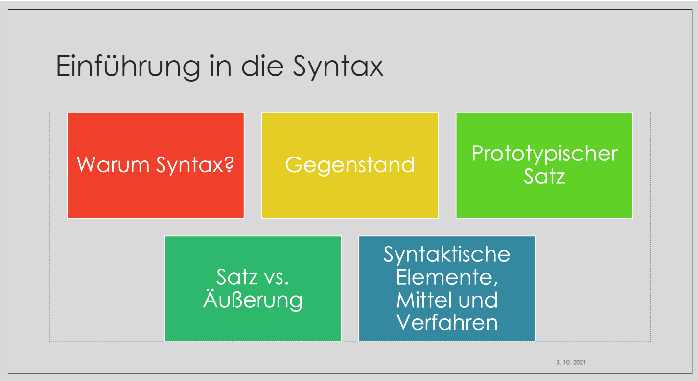

```{r setup00, include=FALSE}
library(knitr)
knitr::opts_chunk$set(
	echo = TRUE,
	message = FALSE,
	warning = FALSE
)

knitr::opts_chunk$set(dev='cairo_pdf') # printing all ipa symbols

```

# Einführung

```{r echo=FALSE, fig.keep='all', out.width="100%"}

```

In diesem Einführungskurs machen wir Sie mit grundlegenden Methoden zur
Erfassung von linguistischen, insbesondere aber syntaktischen Merkmalen
in deutschen und slowenischen Texten bekannt.

Unseren Kurs beginnen wir mit Frage, wozu wir überhaupt über Sprache
reden und *zu welchem Zweck über Syntax?*

Da sich mehrere Wissenschaften mit Sprache auseinandersetzen, ist es
sinnvoll, Syntax von anderen wissenschaftlichen Disziplinen abzugrenzen,
um den *Gegenstand der Syntax* (als Bestandteil der Systemlinguistik)
besser erkennen zu können.

In jeder wissenschaftlichen Disziplin werden grundlegende Einheiten
definiert. In der Syntax ist der *Satz* die maßgebliche Basiseinheit.
Wie jede linguistische Einheit, kann man Sätze verschiedentlich
definieren. Im Rahmen der Einführungsstunde wird ein *prototypischer
Satz* definiert. Von der syntaktischen Einheit *Satz* ist die
kommunikative Einheit *Äußerung* zu unterscheiden.

Andere Themen im Verlauf der Einführung in die deutsche Syntax sind
*syntaktische Elemente, syntaktische Mittel und Verfahren zur Ermittlung
syntaktischer Einheiten* wie etwa der Satztypen, Satzglieder und
Attribute.[^index-1]

[^index-1]: Dieses Buch wurde mit `Bookdown` [@xie2015] verfasst.

Hinweise[^index-2]:

[^index-2]: Clipart von <https://www.clipartmax.com/>.

::: rmdnote
Das ist eine Definition (rmdnote).
:::

::: rmdtip
Das ist ein Tip oder eine Info (rmdtip).
:::

::: rmdrobot
Das ist ein Arbeitsvorschlag (rmdrobot).
:::

::: rmdrstudio
Das ist der RStudio Logotyp (rmdrstudio).
:::

::: rmdwarning
Das ist eine Warnung (rmdwarning).
:::

::: rmderror
Das ist eine Fehlermeldung (rmderror).
:::

```{r include=FALSE}
# automatically create a bib database for R packages
knitr::write_bib(c(
  .packages(), 'bookdown', 'knitr', 'rmarkdown', "tidyverse", "udpipe"
), 'packages.bib')
```

